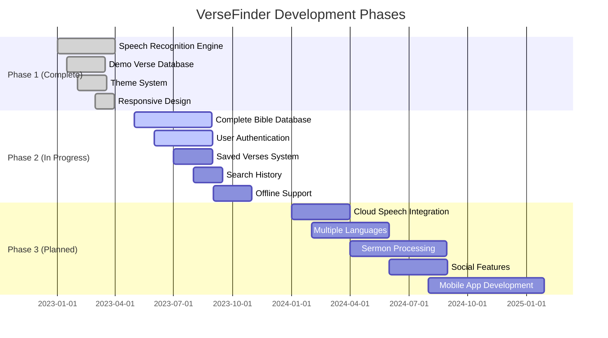

# 📖 VerseFinder

> **Bible verse recognition made simple** - Instantly identify Bible verses through speech or text

VerseFinder is an intuitive application that leverages speech recognition technology to identify Bible verses. Simply speak a verse or upload an audio recording, and VerseFinder will quickly match it, display the complete verse, and provide contextual information.

[](https://versefinder.vercel.app)


## ✨ Key Features

### 🎤 **Verse Recognition**

- **Speech Recognition** - Identify verses through speaking with Web Speech API
- **Text Input** - Enter verse text manually for matching
- **Audio Upload** - Process MP3/WAV recordings of spoken verses
- **Live Transcription** - See spoken words in real-time as you speak

### 📚 **Bible Resources**

- **Multiple Translations** - Support for NIV, ESV, KJV, NASB, and NLT
- **Verse Context** - Get background information for each verse
- **Confidence Scoring** - See how accurately your input matches known verses
- **Demo Collection** - Pre-loaded popular verses for immediate testing

### 🎨 **User Experience**

- **Dark/Light Themes** - Automatic system detection with manual override
- **Responsive Design** - Seamless experience across all device sizes
- **Accessible Interface** - Screen reader support and WCAG compliance
- **Keyboard Navigation** - Complete functionality without mouse input

### �‍💻 **Developer Features**

- **Modern Stack** - React 18, TypeScript, and Express
- **Fast Development** - Hot module reloading for rapid iteration
- **Component Library** - Built with Radix UI primitives
- **Type Safety** - End-to-end TypeScript implementation

## 🚀 Getting Started

### Prerequisites

- **Node.js** 18+ installed
- **npm** or **yarn** package manager
- **Modern browser** with microphone permissions (Chrome/Edge recommended)

### Installation

```bash
# Clone the repository
git clone https://github.com/kiganyamburu/builder-aura-haven.git
cd builder-aura-haven

# Install dependencies
npm install

# Launch development server
npm run dev
```

Your development server will be running at `http://localhost:8080`

### Production Deployment

```bash
# Create optimized production build
npm run build

# Start production server
npm start
```

## 🎯 Using VerseFinder

### Voice Recognition

1. Click and hold the microphone button
2. Speak a Bible verse clearly
3. Watch the live transcript appear
4. Release to process the verse

### Audio File Analysis

1. Select "Upload Audio" option
2. Choose your MP3/WAV recording
3. Let VerseFinder process the audio
4. Review your matched results

### Text Input

1. Click "Test with Text"
2. Type a portion of a Bible verse
3. Submit for instant matching
4. See matching confidence scores

### Managing Results

1. View the identified verse reference
2. Select your preferred translation
3. Read full context and explanation
4. Save verses for later reference

## 📋 Demo Verse Collection

Try VerseFinder with these pre-loaded popular verses:

| Reference            | Translation | Beginning of Verse                          |
| -------------------- | ----------- | ------------------------------------------- |
| John 3:16            | NIV         | "For God so loved the world..."             |
| Philippians 4:13     | ESV         | "I can do all things through him..."        |
| Psalm 23:1           | KJV         | "The Lord is my shepherd..."                |
| Romans 8:28          | NASB        | "And we know that God causes all things..." |
| Jeremiah 29:11       | NLT         | "For I know the plans I have for you..."    |
| Isaiah 40:31         | NIV         | "But those who hope in the Lord..."         |
| Matthew 28:19-20     | ESV         | "Go therefore and make disciples..."        |
| 1 Corinthians 13:4-7 | KJV         | "Love is patient, love is kind..."          |

## 🛠️ Technology Stack

### Frontend

```
React 18  →  TailwindCSS 3  →  Radix UI Components
    ↓             ↓                    ↓
TypeScript  ←  React Router 6  ←  Lucide Icons
```

### Backend & APIs

```
Express.js  →  RESTful API Design
    ↓              ↓
Node.js  ←  Web Speech API Integration
```

### Development Ecosystem

```
Vite  →  Hot Module Replacement  →  TypeScript
 ↓              ↓                      ↓
Vitest  ←  ESLint + Prettier  ←  Type Safety
```

### Core Technologies

- **Speech Recognition**: Web Speech API with fallback options
- **Verse Matching**: Custom fuzzy matching algorithms
- **State Management**: React Context API
- **Styling**: TailwindCSS with custom theme variables

## 📁 Project Architecture

```
VerseFinder/
│
├── client/                      # React SPA frontend
│   ├── components/              # UI building blocks
│   │   ├── ui/                 # Radix UI components
│   │   └── theme-toggle.tsx    # Theme switcher
│   │
│   ├── contexts/               # React context providers
│   │   └── theme-context.tsx   # Dark/light theme state
│   │
│   ├── lib/                    # Core functionality
│   │   ├── utils.ts            # Utility functions
│   │   └── verse-recognition.ts # Verse matching engine
│   │
│   ├── pages/                  # Application routes
│   │   ├── Index.tsx           # Main interface
│   │   ├── History.tsx         # Past searches
│   │   ├── Saved.tsx           # Bookmarked verses
│   │   └── NotFound.tsx        # 404 handler
│   │
│   ├── App.tsx                 # Main component & routing
│   └── global.css              # Global styles & theming
│
├── server/                      # Express backend
│   ├── routes/                 # API endpoints
│   ├── index.ts                # Server configuration
│   └── node-build.ts           # Production server setup
│
├── shared/                      # Cross-environment code
│   └── api.ts                  # Shared type definitions
│
└── public/                      # Static assets
```

## ⚙️ Development Commands

| Command              | Description                                 |
| -------------------- | ------------------------------------------- |
| `npm run dev`        | Start development server with hot reloading |
| `npm run build`      | Create optimized production build           |
| `npm start`          | Launch production server                    |
| `npm test`           | Run test suite                              |
| `npm run typecheck`  | Verify TypeScript types                     |
| `npm run format.fix` | Format code with Prettier                   |

## � Theming & Accessibility

VerseFinder features a thoughtful theme system designed for all users:

- **System Theme Detection**: Automatically matches your device preferences
- **Manual Theme Control**: Easy toggle with persistent storage
- **Smooth Transitions**: Elegant animations between theme states
- **High Contrast Options**: Enhanced readability for all users
- **Keyboard Navigation**: Complete functionality without mouse input

## 🔍 Compatibility Guide

| Browser       | Speech Recognition | Audio Upload | Text Matching |
| ------------- | ------------------ | ------------ | ------------- |
| Chrome        | ✅ Full support    | ✅ Supported | ✅ Supported  |
| Edge          | ✅ Full support    | ✅ Supported | ✅ Supported  |
| Firefox       | ⚠️ Limited         | ✅ Supported | ✅ Supported  |
| Safari        | ⚠️ Limited         | ✅ Supported | ✅ Supported  |
| Mobile Chrome | ✅ Supported       | ✅ Supported | ✅ Supported  |
| Mobile Safari | ⚠️ Limited         | ✅ Supported | ✅ Supported  |

> **Note**: Firefox and Safari have limited speech recognition capabilities due to browser API restrictions. All other features work perfectly across all modern browsers.

## 🚧 Development Roadmap



> **Current Focus**: Expanding the verse database and implementing user accounts to enable saved verses and personalization.

## 🤝 Contributing

We welcome contributions from developers of all skill levels! Here's how to get started:

```
                 ┌───────────────┐
                 │  Fork Repo    │
                 └───────┬───────┘
                         │
                         ▼
          ┌─────────────────────────────┐
          │  git checkout -b feature/*  │
          └──────────────┬──────────────┘
                         │
                         ▼
          ┌─────────────────────────────┐
          │   Make Your Improvements    │
          └──────────────┬──────────────┘
                         │
                         ▼
          ┌─────────────────────────────┐
          │      Add Tests (Vitest)     │
          └──────────────┬──────────────┘
                         │
                         ▼
          ┌─────────────────────────────┐
          │       Submit PR             │
          └─────────────────────────────┘
```

### Code Standards

Our project maintains high standards for all contributions:

- **TypeScript Only**: All code must be properly typed
- **Test Coverage**: Include tests for new functionality
- **Accessibility**: WCAG AA compliance required
- **Documentation**: Update relevant documentation
- **Code Style**: Follow the established project patterns

## 📝 License & Acknowledgments

This project is available under the [MIT License](LICENSE).

Special thanks to:

- The Web Speech API team for speech recognition capabilities
- Radix UI for accessible component primitives
- TailwindCSS team for their exceptional styling framework
- Vite contributors for the blazing fast development experience
- The open source Bible API providers

## � Contact & Support

- **Creator**: [Peter Mburu](mailto:mburukiganya@gmail.com)
- **Issues & Bugs**: [GitHub Issues](https://github.com/kiganyamburu/builder-aura-haven/issues)
- **Feature Requests**: [GitHub Discussions](https://github.com/kiganyamburu/builder-aura-haven/discussions)
- **Security Concerns**: [security@versefinder.dev](mailto:security@versefinder.dev)

---

<div align="center">

[](https://github.com/kiganyamburu/builder-aura-haven)

**VerseFinder: Making scripture recognition accessible to everyone**

</div>
